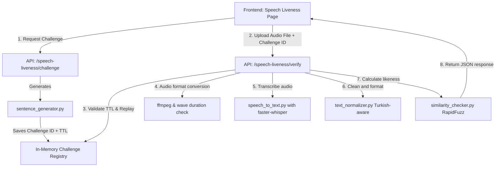

# Speech Liveness Detection Module Implementation Plan

This plan outlines the technical design, architectural details, and implementation workflow for adding a new **Active Speech Liveness Detection** module to our "Biometric Identification with Liveness Detection" graduation project. 

The module asks the user to speak a randomly generated 4–5 word Turkish sentence, records their voice via the microphone, and performs speech-to-text (STT) on the backend using `faster-whisper`. The transcript is normalized and compared with the target sentence using fuzzy string matching (`rapidfuzz`/`Levenshtein`). If the similarity is $\ge 80\%$, the liveness check succeeds.

---

## User Review Required

> [!IMPORTANT]
> **Dependencies to Install:**
> - Backend python packages: `faster-whisper` (for highly optimized ONNX-backed speech-to-text) and `rapidfuzz` (for extremely fast fuzzy string similarity comparison).
> - System Dependency: `ffmpeg` is required to ensure browser-recorded audio formats (WebM/OGG) can be seamlessly converted to 16kHz mono WAV for processing. Since `ffmpeg` is not in the system path, we propose installing it via Windows Package Manager:
>   `winget install Gyan.FFmpeg --accept-source-agreements --accept-package-agreements`
>   *Note: Our Python backend code will have a robust fallback, gracefully telling the user if `ffmpeg` is missing, but installing it makes the system fully robust.*

> [!WARNING]
> **Security Configurations:**
> - **Expirations:** The speech challenge expires strictly after **8 seconds** of generation.
> - **Anti-Replay Protection:** We will hash (SHA-256) all incoming audio files. If the same audio is submitted twice, it is blocked immediately as a replay attack.
> - **Audio Duration Checks:** We verify the duration of the audio from the WAV file headers; audio that is $< 0.5$ seconds or $> 6.0$ seconds is automatically rejected.

---

## Open Questions

> [!NOTE]
> We have fully designed the module based on your clear specifications. There are no blocking open questions, but we chose to implement an **in-memory, thread-safe challenge registry with automatic cleanup** instead of complicating the SQLite database schema. Since speech challenges are short-lived (8-second TTL), this is extremely fast and prevents DB bloating.

---

## Proposed Changes

We will group our files logically by layer (Backend first, then Frontend components).

---

### Backend (FastAPI)

We will create a self-contained package `core/speech_liveness` to house the core business logic, keeping it clean and easily importable by other modules or pipelines.

#### [MODIFY] [requirements.txt](file:///c:/Users/mitha/Desktop/Projeler/Grad/backend/requirements.txt)
- Add `faster-whisper` and `rapidfuzz` to the requirements list.

#### [NEW] [sentence_generator.py](file:///c:/Users/mitha/Desktop/Projeler/Grad/backend/core/speech_liveness/sentence_generator.py)
- Predefines a list of simple, phonetic, and easy-to-pronounce 4–5 word Turkish sentences (e.g., `"mavi araba yolda gidiyor"`, `"küçük kedi süt içiyor"`, `"ali kırmızı kalemi aldı"`, `"bugün hava çok güzel"`, etc.).
- Keeps a lock-protected history of generated sentences to ensure no back-to-back duplicate sentence generations.
- Contains a thread-safe `ChallengeRegistry` that stores `challenge_id`, `target_text`, `created_at`, and `is_used` with an 8-second time-to-live (TTL).

#### [NEW] [text_normalizer.py](file:///c:/Users/mitha/Desktop/Projeler/Grad/backend/core/speech_liveness/text_normalizer.py)
- Implements `turkish_lower()` to handle Turkish character casing correctly (e.g., mapping `I` to `ı` and `İ` to `i`).
- Strips punctuation marks, multiple consecutive whitespaces, and trims boundaries.
- Leaves Turkish special letters (`ç, ğ, ı, ö, ş, ü`) fully intact.

#### [NEW] [similarity_checker.py](file:///c:/Users/mitha/Desktop/Projeler/Grad/backend/core/speech_liveness/similarity_checker.py)
- Computes string likeness using `rapidfuzz.fuzz.ratio` (with a pure-Python `difflib.SequenceMatcher` fallback to keep it safe).
- Word-by-word matching percentage calculation: checks the ratio of words successfully pronounced by the user (allowing soft-matching on words to handle minor accents or slips).
- Resolves phonetic slips elegantly (e.g., "gidiyo" to "gidiyor" will pass easily because Levenshtein distance handles it well within the 80% threshold).

#### [NEW] [speech_to_text.py](file:///c:/Users/mitha/Desktop/Projeler/Grad/backend/core/speech_liveness/speech_to_text.py)
- Integrates `faster-whisper` using a singleton/lazy-loading wrapper to load the optimized `tiny` model (weights are ~75MB, extremely fast on both CPU and GPU).
- Configures model transcription language strictly to `"tr"` for maximum Turkish accuracy.

#### [NEW] [speech_liveness_routes.py](file:///c:/Users/mitha/Desktop/Projeler/Grad/backend/api/speech_liveness_routes.py)
- `POST /speech-liveness/challenge`: Triggers sentence generation and stores the challenge in the registry.
- `POST /speech-liveness/verify`:
  - Receives `challenge_id` and the `audio_file` (via multipart/form-data).
  - Checks if the challenge has expired (> 8s) or was already used.
  - Computes the SHA-256 hash of the audio binary to block replay attacks.
  - Validates audio duration (0.5s to 6s) using standard Python `wave` module after temporary wav creation.
  - Converts incoming audio to 16kHz mono WAV using `ffmpeg` subprocess.
  - Calls Whisper STT, normalizes output, calculates similarity, and responds with a rich JSON contract.

#### [MODIFY] [main.py](file:///c:/Users/mitha/Desktop/Projeler/Grad/backend/main.py)
- Mounts `/api/v1/speech-liveness` router using `app.include_router(speech_liveness_router, prefix="/api/v1")`.

---

### Frontend (Next.js)

We will build a high-fidelity interface integrated into the existing application utilizing identical layout elements, CSS variables, and glassmorphism.

#### [MODIFY] [api.ts](file:///c:/Users/mitha/Desktop/Projeler/Grad/frontend/lib/api.ts)
- Adds `getSpeechChallenge()` and `verifySpeechLiveness(challengeId, audioBlob)` functions to fetch challenges and post form-data audio files.

#### [MODIFY] [api.ts](file:///c:/Users/mitha/Desktop/Projeler/Grad/frontend/types/api.ts)
- Adds TypeScript contracts matching the backend request/response structures.

#### [NEW] [page.tsx](file:///c:/Users/mitha/Desktop/Projeler/Grad/frontend/app/speech-liveness/page.tsx)
- Sleek voice liveness page:
  - Big, bold, modern card showcasing the target sentence in large readable typography.
  - Interactive "Speak" button requesting browser mic permissions gracefully.
  - Soundwave/Pulse micro-animations matching the state ("Dinleniyor...", "Ses İşleniyor...") to keep the app responsive and alive.
  - Limits recording to exactly 5 seconds using a browser timer, stopping automatically.
  - Premium result layout: displays target text, transcribed words, matching similarity percentage, and success/fail cards with beautiful HSL colors.
  - Quick-retry workflow resetting all timers and challenge state instantly.

---

## Verification Plan

### Automated & Manual Tests
1. **Dependency Validation:**
   - Execute pip commands to verify the local python environment installs `faster-whisper` and `rapidfuzz` correctly.
2. **Audio File Robustness:**
   - Send short (e.g. 0.2s) or long (e.g. 10s) audio files and verify the API returns HTTP 400 with a detailed error message.
   - Send the same audio twice to verify the SHA-256 anti-replay filter activates and prevents verification.
3. **Accuracy & Thresholding:**
   - Record Turkish speech matching the target. Assert that similarity is $\ge 80\%$.
   - Pronounce slightly incorrect versions (e.g. omitting "r" at the end of verbs like "gidiyor") to confirm Levenshtein matching still scores above 80% and successfully registers success.
4. **End-to-End Visual Demo:**
   - Open Next.js browser page, perform mic capture, and confirm full lifecycle is visually seamless.
